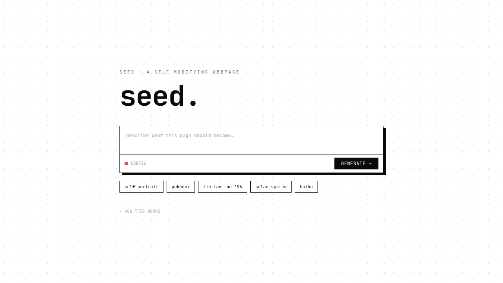

# 🌱 seed

**a self-modifying webpage.**

🔗 **[try it live → oxedom.github.io/seed](https://oxedom.github.io/seed/)**



Type a description, and a configurable LLM (Claude, OpenAI, any OpenAI-compatible endpoint, or Chrome's on-device Gemini Nano) returns raw HTML that replaces the canvas. Generated pages can call `window.regenerate(prompt)` to reproduce themselves. 🪴

## how it works

- **URL-encoded state** — the full page is gzip-compressed and base64url-encoded into `?s=`, so any page can be shared or restored by link alone — no server, no storage
- **Floating control panel** — regenerate, copy share URL, configure, or reset — draggable and survives every generation
- **Self-modifying** — generated pages can trigger their own regeneration via `window.regenerate(prompt)`

## providers

| Provider | Notes |
|---|---|
| Claude | Anthropic API key |
| OpenAI | OpenAI API key |
| OpenAI-compatible | Any endpoint (Ollama, Groq, etc.) |
| Gemini Nano | Chrome's on-device model, no key needed |

## usage

Open [seed on GitHub Pages](https://oxedom.github.io/seed/) or clone and open `index.html` — no build step, no dependencies.

```bash
git clone https://github.com/oxedom/seed
open seed/index.html
```

Enter your API key in the config panel, type a prompt, and watch the page become something new. 🌱
